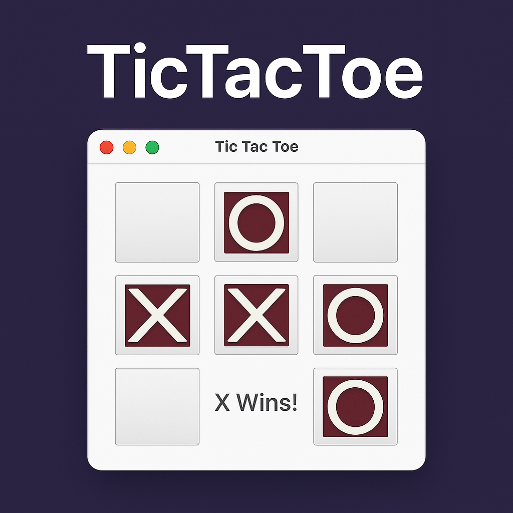
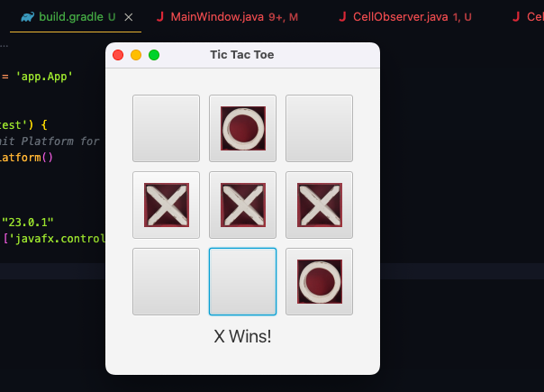

# TicTacToe

<p align="center">

</p>

          


## ❔Overview

This TicTacToe game is built using JavaFX and GUI. It is very similar to the original game of TicTacToe where two players can play their turns untill who wins.

## 🎮 Controls

The controls of this game are quite simple. You can navigate the current block by either using the arrow keys or WASD.
- LEFT ARROW -  left
- RIGHT ARROW - right
- DOWN ARROW  - down

## 👀 Game Demo

🎬 [Watch the demo](CuatrosGame.mp4)


### ✨ TicTacToe Game Screen

<p align="center">

</p>

#### System Requirements

> Both MacOS and Windows supported.
> Better optimized for MacOS.


## Code

### 🛠️ Environment Setup

```bash
git clone https://github.com/bjucps209/group-project-team-jd.git
```

#### Gradle Setup

```bash
gradle init --type java-application --dsl groovy --package app --test-framework junit-jupiter --use-defaults --overwrite 
```
#### Gradle commands

```bash
gradle clean build
```

```bash
gradle run
```

#### JavaFX Setup
##### Add a line to app/build.gradle
```bash
plugins {
    id 'application'
    id 'jacoco'
    id 'org.openjfx.javafxplugin' version '0.1.0'
}
```
#### Add a new block to the bottom of app/build.gradle:
```bash
javafx {
    version = "23.0.1"
    modules = [ 'javafx.controls', 'javafx.fxml', 'javafx.media' ]
}
```

## ✨ Credits

> + David Geddam [github.com](https://github.com/dave21-py)

## 🚀 Citation

If you find our work useful, please consider citing:

```
title={TicTacToe},
  author={David Geddam},
  year={2025}
}
```

## 📭 Contact

For any questions, please raise a concern or contact us at
+ David Geddam [linkedin.com](https://www.linkedin.com/in/david-geddam/)
